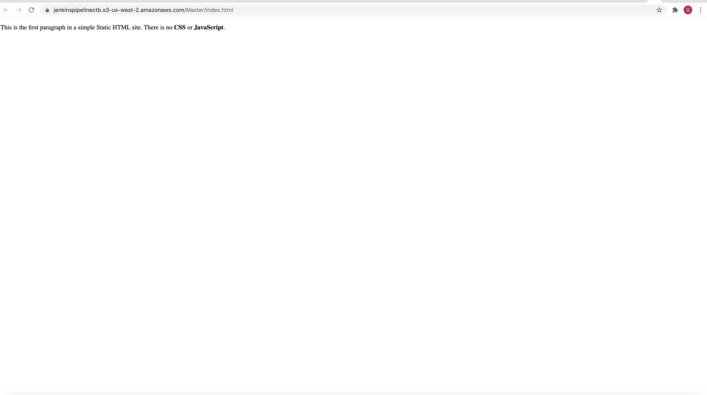

# USE A JENKINS PIPELINE AND IaaC TO DEPLOY STATIC WEBSITE HOSTED ON AWS S3

The purpose of this project is to launch a EC2 instance to host a jenkins Server that will help us use a pipeline to trigger the deployment of a website hosted on AWS S3 using multiple branches.

# HOW TO USE FILES IN REPO

create.sh
---------------

Run `bash create.sh stackname  file.yaml file.json`
Tip: You want to run the environments for the networks and users first before the servers.

Replace `stackname` with the a name for your stack
Replace `file.yaml` with your infrastructure resources yaml file
Replace `file.json` with your infrastructure parameter file

delete.sh
----------------
Run `bash delete.sh stackname`

Replace `stackname` with the a name for your stack

jenkinsenvironment.json
-----------------------
Contains the json parameter file for your network environments. Can be used to change the environment name

jenkinsenvironment.yaml
-----------------------
Contains the yaml file to launch the network environment resources

JenkinsServers.json
---------------------
Contains the json parameter file for your servers. Can be used the change the environment name for your Servers

JenkinsServers.yaml
--------------------
Contains the yaml file to launch the servers to host your apps

update.sh
-------------------
Run `bash update.sh stackname  file.yaml file.json`

Replace `stackname` with the a name for your stack
Replace `file.yaml` with your infrastructure resources yaml file
Replace `file.json` with your infrastructure parameter file

index.html
-------------------
Contains a sample html of a static website

Jenkinsfile
--------------------
Contains the jenkins pipeline steps top build the project and deploy to S3.

# STEP BY STEP GUIDE TO LAUNCH WEBSITE ON AWS
* Run `git clone repo`

* Run `cd repo`

* Run `bash create.sh jenkinsenvironments jenkinsenvironment.yaml jenkinsenvironment.json`

* Wait for jenkinsenvironments stack to be created

* Adjust the ip addresses in the yaml files to avoid errors in AWS

* Run `bash create.sh jenkinsservers jenkinservers.yaml JenkinsServers.json`

* Wait for jenkinsservers stack to be created

* Navigate to yourawsec2ip:8080 and copy the directory to find jenkins admin password

* Allow your ip to SSH into your EC2 instance

* SSH into your instance and run `sudo cat directory` copying the directory from jenkins page

* Copy jenkins password from ssh session into jenkins UI to access the UI

* Setup blue ocean and aws pipeline plugins

* Add keys for aws user in jenkins config

* Restart jenkins in ssh session

* Check in this project to your own repo

* Create new pipline in blue ocean and integrate your github to jenkins using github access token then select this project in aws

* Pipelines should build successfully

* Run `bash delete.sh jenkinsservers`

* Wait for s3environments stack to be deleted

* Run `bash delete.sh jenkinsenvironments`

* Verify stack is deleted in console to avoid recurring charges

S3 static website output should look like this
-----------------------------------------------

